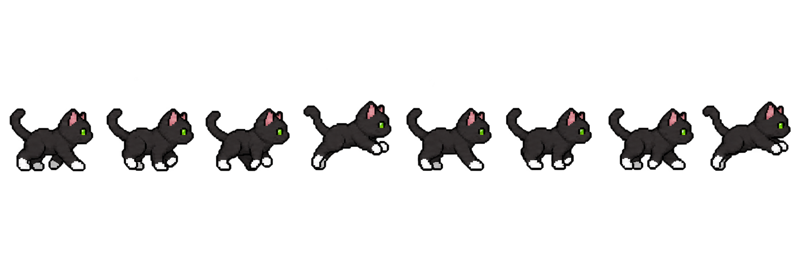
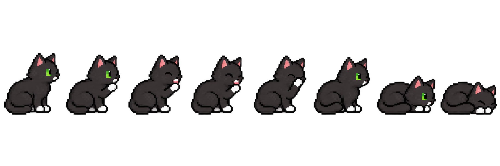
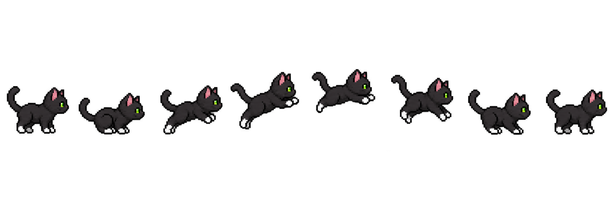
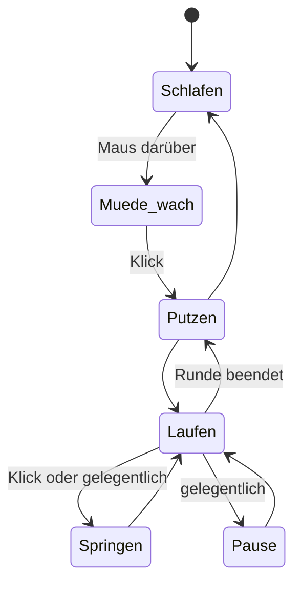
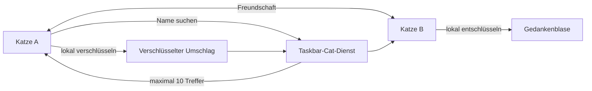

# 🐾 Taskbar Cat

Eine kleine schwarze Pixelkatze für die Windows-11-Taskleiste. **Sneaker** schläft am Bildschirmrand, wacht beim Darüberfahren mit der Maus auf und beginnt nach einem Klick ihre Runde. Sie kann laufen, springen, sich putzen und Nachrichten anderer Katzen als Gedankenblase anzeigen.

[](https://github.com/realr4an/taskbar-cat/releases/latest)
[](#download)
[](LICENSE)

## Sneaker in Bewegung

Die Animationen bestehen aus handabgestimmten Einzelbildern. Die App bewegt die Katze mit 60 Aktualisierungen pro Sekunde, während die eigentlichen Posen bewusst etwas länger sichtbar bleiben. Dadurch wirkt die Bewegung ruhig und pixeltypisch statt hektisch.

### Laufen



### Putzen und springen

<p align="center">
  
  
</p>

## Bedienung

| Aktion | Reaktion der Katze |
| --- | --- |
| Maus über die schlafende Katze bewegen | Sie hebt müde den Kopf, bleibt aber liegen. |
| Katze anklicken | Sie putzt sich und läuft anschließend los. |
| Laufende Katze anklicken | Sie reagiert mit einem Sprung in ihre Laufrichtung. |
| Katze ziehen | Sie kann versetzt werden und läuft am neuen Ort weiter. |
| Eine Weile warten | Sie macht Putzpausen, miaut oder legt sich wieder schlafen. |
| Tray-Symbol öffnen | Katzenmenü anzeigen, pausieren oder die App beenden. |

## Funktionen

- transparente, nicht störende Desktop-Figur oberhalb der Taskleiste
- getrennte Animationen für Schlafen, Aufwachen, Laufen, Putzen und Springen
- korrekte Spiegelung für beide Laufrichtungen
- frei einstellbarer Bildschirm und Bewegungsbereich
- eindeutiger öffentlicher Katzenname; Standardname ist `Sneaker`
- Suche nach Katzennamen mit bis zu zehn ähnlichen Treffern
- gegenseitige Freundesliste ohne Austausch langer Einladungscodes
- verschlüsselte Nachrichten in automatisch wachsenden Gedankenblasen
- Tray-Menü mit Einstellungen, Pause und Beenden
- automatische Aktualisierung über geprüfte GitHub-Releases
- eigenständige EXE ohne separate .NET-Installation

## Die Designidee

Taskbar Cat soll sich wie ein kleiner, ruhiger Mitbewohner anfühlen und nicht wie ein weiteres Programmfenster. Darum folgt das Projekt vier Grundideen:

1. **Unaufdringlich:** Die Katze bleibt an der unteren Bildschirmkante und blockiert keine normale Bedienung.
2. **Natürlich reagierend:** Hover weckt sie nur auf. Erst ein bewusster Klick startet eine Aktivität.
3. **Wiedererkennbar:** Schwarzes Fell, grüne Augen und weiße Pfoten bleiben in allen Posen erhalten.
4. **Persönlich:** Jede Katze erhält einen eigenen Namen, kann Freunde finden und kurze Nachrichten sichtbar überbringen.



## Katzenfreunde und Nachrichten

Im Katzenmenü reicht ein Teil des gesuchten Namens. Die App zeigt höchstens zehn passende Katzen an. Wird eine Katze hinzugefügt, erscheint die Verbindung automatisch auf beiden Freundeslisten. Anschließend können Nachrichten mit bis zu 500 Zeichen gesendet werden.



Normale Freundesnachrichten werden auf dem sendenden PC mit ECDH P-256 und AES-256-GCM verschlüsselt. Private Schlüssel sowie das Geräte-Token sind mit Windows DPAPI an das Windows-Benutzerkonto gebunden. Nicht zugestellte Nachrichten laufen nach spätestens sieben Tagen ab. Weitere Einzelheiten stehen in [SECURITY.md](SECURITY.md).

## Download

1. Unter [Releases](https://github.com/realr4an/taskbar-cat/releases/latest) die aktuelle `TaskbarKatze.exe` herunterladen.
2. Die EXE starten. Eine Installation ist nicht erforderlich.
3. Das Katzenmenü über das Tray-Symbol öffnen und Name, Bildschirm sowie Bewegungsbereich einstellen.

Windows kann bei einer noch nicht kommerziell signierten Anwendung einen SmartScreen-Hinweis anzeigen. Veröffentlichte Dateien enthalten deshalb zusätzlich eine SHA-256-Prüfsumme im jeweiligen Release.

## Projektaufbau

```text
taskbar-cat/
├─ src/TaskbarCat/          Windows-App, Animationen und lokale Kryptografie
│  └─ Assets/               Pixel-Art-Sprite-Sheets
├─ backend/                 Cloudflare Worker und D1-Migrationen
├─ .github/workflows/       automatischer Build und Release
├─ SECURITY.md              Sicherheits- und Datenschutzmodell
└─ LICENSE                  MIT-Lizenz
```

Die Desktop-App verwendet Windows Forms auf .NET 9. Das schlanke Backend läuft als Cloudflare Worker mit D1. Jeder Push auf `main` erstellt automatisiert eine eigenständige Windows-EXE und ein versioniertes GitHub-Release.

## Lokal entwickeln

Voraussetzung ist das .NET 9 SDK auf Windows:

```powershell
dotnet build src/TaskbarCat/TaskbarCat.csproj
```

Backend prüfen:

```powershell
cd backend
npm ci
npm test
```

## Datenschutz

In der Namenssuche sichtbar ist der selbst gewählte Katzenname. Für die technische Zustellung verarbeitet der Dienst Geräte-IDs, Freundschaftsbeziehungen und Zeitpunkte. Nachrichteninhalte zwischen Freunden werden ausschließlich verschlüsselt übertragen. Das vollständige Schutzmodell und seine Grenzen sind in [SECURITY.md](SECURITY.md) dokumentiert.

## Lizenz

Quellcode und projektspezifische Sneaker-Sprites stehen unter der [MIT-Lizenz](LICENSE).
